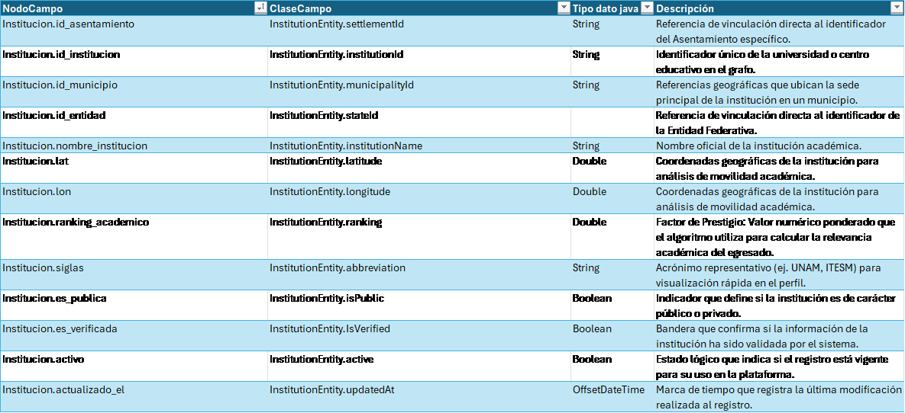
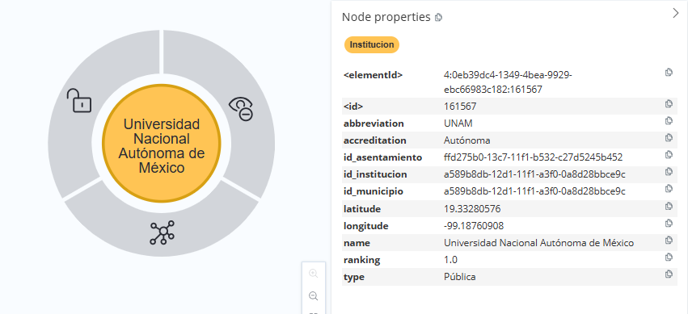
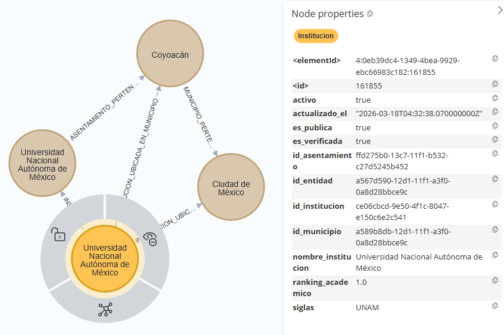

[← modelo de grafos](./modelo-de-grafos.md#nodos-de-catálogo)

# Institucion - InstitutionEntity

El nodo **`Institucion`** representa una organización académica o profesional relacionada con la formación y acreditación de los prestadores de servicios legales dentro del grafo. Su estructura permite identificar la institución, caracterizarla mediante información académica y administrativa, y contextualizar geográficamente su ubicación.

* **Identificación y Caracterización Institucional:**
  El nodo concentra la información que identifica a la institución, incluyendo su nombre oficial y siglas, mediante un identificador único. Esta representación permite mantener una referencia normalizada de la institución dentro del grafo y reutilizarla desde las entidades que mantienen una relación con ella.

* **Información Académica y Estado de Verificación:**
  El nodo incorpora el `ranking_academico` asociado a la institución, así como los indicadores `es_publica` y `es_verificada`. Estos atributos permiten representar características académicas, administrativas y de verificación de la institución dentro del modelo.

* **Estado y Ubicación Institucional:**
  El registro mantiene información sobre su vigencia mediante el atributo `activo` y registra la fecha de actualización mediante `actualizado_el`. Asimismo, incorpora referencias territoriales que permiten asociar la institución con un Estado, Municipio y Asentamiento determinados.

## Lógica de Conectividad

En la arquitectura de catálogos, el nodo **`Institucion`** se vincula con la estructura geográfica mediante las relaciones `INSTITUCION_UBICADA_EN_ESTADO`, `INSTITUCION_UBICADA_EN_MUNICIPIO` e `INSTITUCION_UBICADA_EN_ASENTAMIENTO`.

Estas relaciones permiten representar la ubicación de la institución dentro de diferentes niveles de la estructura territorial y mantener su contexto geográfico dentro del grafo. La institución puede, a su vez, participar en relaciones con otras entidades que la referencien dentro del modelo académico y profesional.

