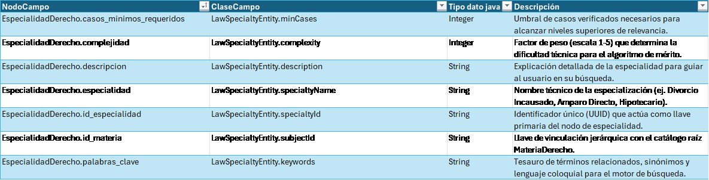
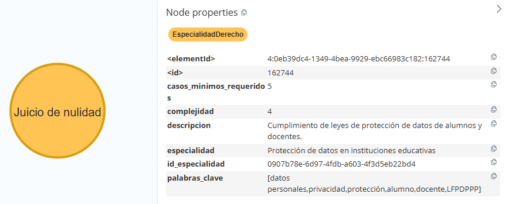
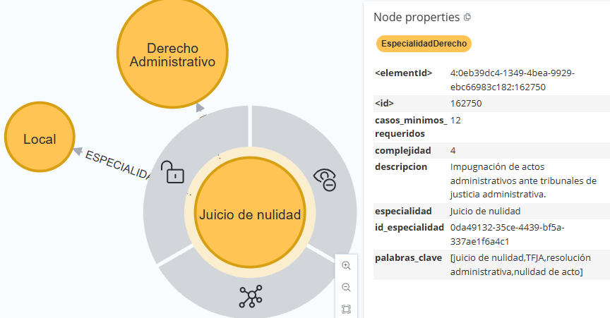

[← modelo de grafos](./modelo-de-grafos.md#nodos-de-catálogo)

# EspecialidadDerecho - LawSpecialtyEntity

El nodo **`EspecialidadDerecho`** representa un área específica de práctica jurídica dentro de la taxonomía legal del sistema. Define las características que permiten contextualizar una especialidad, relacionarla con una materia de derecho y establecer parámetros para la evaluación de experiencia y mérito profesional.

* **Cuantificación del Mérito Profesional:**
  Los atributos `complejidad` y `casos_minimos_requeridos` establecen parámetros utilizados por el sistema de evaluación de mérito. La complejidad representa el nivel de dificultad asociado a la especialidad, mientras que el número mínimo de casos establece el umbral requerido para la evaluación del profesional en dicha especialidad.

* **Contextualización e Indexación Semántica:**
  El nombre y la descripción de la especialidad proporcionan información semántica para su clasificación, indexación y recuperación. Esta información permite contextualizar los conceptos jurídicos asociados a una especialidad y participa en los procesos de búsqueda y clasificación semántica del sistema.

* **Jerarquización del Conocimiento Jurídico:**
  La especialidad constituye un nivel específico dentro de la taxonomía jurídica y se relaciona con una `MateriaDerecho` de nivel superior. Asimismo, puede asociarse con uno o más fueros mediante `ESPECIALIDAD_TIENE_FUERO`, permitiendo complementar la clasificación de la especialidad con el ámbito jurisdiccional correspondiente.

## Lógica de Conectividad

En la arquitectura de catálogos, el nodo **`EspecialidadDerecho`** se vincula con su materia jurídica mediante la relación `ESPECIALIDAD_PERTENECE_A_MATERIA` y con los fueros correspondientes mediante `ESPECIALIDAD_TIENE_FUERO`.

Asimismo, recibe la relación `ES_ESPECIALIDAD` desde la entidad que representa la especialidad de un abogado, estableciendo la asociación entre el profesional y la especialidad jurídica.

Esta estructura permite recorrer la taxonomía desde la materia hacia sus especialidades, complementar cada especialidad con sus ámbitos jurisdiccionales y relacionarla con los profesionales que la tienen registrada.

