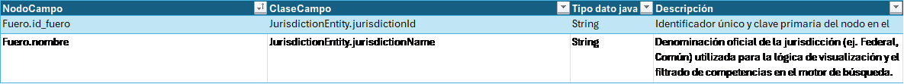
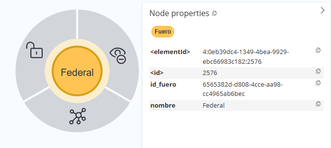
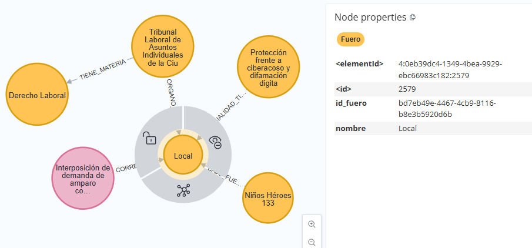

[← modelo de grafos](./modelo-de-grafos.md#nodos-de-catálogo)

# Fuero - JurisdictionEntity

El nodo **`Fuero`** representa el ámbito de jurisdicción legal bajo el cual se organiza la actividad de las entidades jurídicas y judiciales dentro del grafo. Su función es proporcionar una referencia normalizada para distinguir ámbitos jurisdiccionales como `Federal` y `Común`.

* **Clasificación Jurisdiccional:**
  El nodo establece la clasificación del ámbito de competencia mediante el atributo `nombre`, permitiendo distinguir los diferentes fueros contemplados por el catálogo jurídico. Esta clasificación proporciona una referencia común para las entidades que requieren contextualizarse dentro de un ámbito jurisdiccional determinado.

* **Referencia Normalizada de la Jurisdicción:**
  Cada fuero se identifica mediante un identificador único `id_fuero` y un nombre oficial `nombre`. Esta estructura permite mantener una representación consistente de los ámbitos jurisdiccionales y utilizarlos como referencia común dentro del grafo.

* **Contextualización de la Actividad Jurídica:**
  El fuero proporciona el contexto jurisdiccional utilizado para relacionar especialidades jurídicas con las entidades que participan en la estructura judicial. De esta forma, permite complementar la clasificación de las especialidades y de las entidades judiciales con el ámbito de competencia correspondiente.

## Lógica de Conectividad

En la arquitectura del grafo, el nodo **`Fuero`** funciona como un punto de articulación entre diferentes componentes de la estructura jurídica y judicial. Se relaciona con los nodos **`EspecialidadDerecho`** mediante `ESPECIALIDAD_TIENE_FUERO` y participa en las conexiones que vinculan los casos tipo con su ámbito jurisdiccional mediante `CORRESPONDE_A_FUERO`.

Asimismo, el fuero se relaciona con las entidades que representan la estructura judicial, como **`SedeJusticia`** y **`OrganoJurisdiccional`**, permitiendo recorrer el grafo desde una especialidad o un caso jurídico hacia el ámbito jurisdiccional y, posteriormente, hacia las entidades judiciales correspondientes.

Esta conectividad permite utilizar el fuero como referencia transversal para consultas que requieren identificar el ámbito jurisdiccional asociado a una especialidad, un caso o una estructura judicial.

