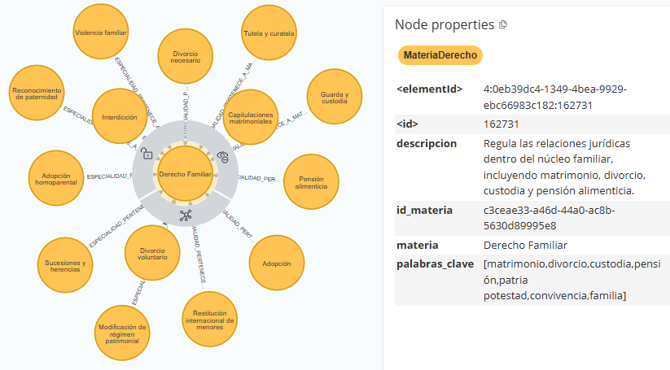

[← modelo de grafos](./modelo-de-grafos.md#nodos-de-catálogo)

# MateriaDerecho - SubjectLawEntity

El nodo **`MateriaDerecho`** representa una categoría de nivel superior dentro de la taxonomía jurídica del sistema. Agrupa las especialidades jurídicas que pertenecen a un mismo ámbito del derecho y proporciona el contexto necesario para organizar, clasificar y relacionar el conocimiento jurídico dentro del grafo.

* **Eje de Clasificación Taxonómica:**
  El nodo establece el nivel superior de clasificación de la taxonomía jurídica y permite agrupar múltiples especialidades bajo una misma materia. Por ejemplo, `Derecho Familiar` puede agrupar especialidades relacionadas con adopción, custodia o pensión alimenticia. Esta estructura proporciona una organización jerárquica del conocimiento jurídico.

* **Contextualización y Clasificación Semántica:**
  La materia proporciona información semántica mediante su nombre y descripción, que permiten contextualizar las especialidades y conceptos jurídicos asociados. Esta información participa en procesos de clasificación semántica, generación de datasets y contextualización de búsquedas dentro del sistema.

* **Priorización y Clasificación del Conocimiento:**
  Los atributos `prioridad` y `label` permiten incorporar criterios numéricos asociados a la materia jurídica. `prioridad` proporciona un valor relativo para procesos de relevancia o evaluación, mientras que `label` permite representar una clasificación numérica utilizada por los procesos de identificación y tratamiento semántico del conocimiento jurídico.

## Lógica de Conectividad

En la arquitectura de catálogos, el nodo **`MateriaDerecho`** recibe conexiones entrantes desde los nodos **`EspecialidadDerecho`** mediante la relación `ESPECIALIDAD_PERTENECE_A_MATERIA`.

Esta relación establece la pertenencia de cada especialidad a una materia jurídica y permite recorrer la taxonomía desde un ámbito general hacia sus especialidades específicas. De esta forma, `MateriaDerecho` funciona como un punto de agrupación dentro de la estructura de clasificación jurídica del grafo.

