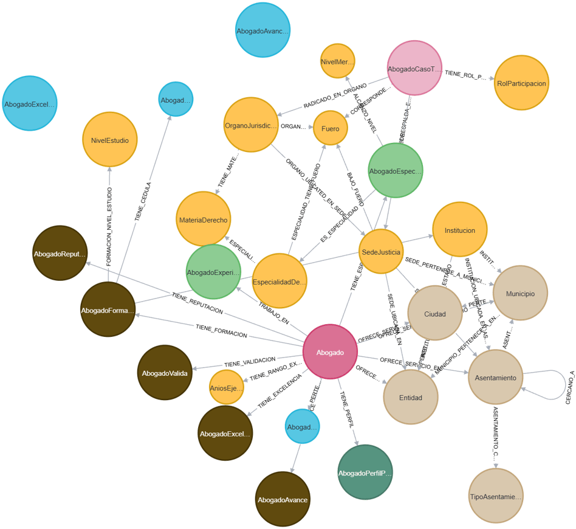

[← Volver a página principal](../../README.md#estructura-de-la-documentación-técnica)

# Modelo de Grafos de Neo4j: Arquitectura de Datos de AliadoLegal

Este documento detalla el modelo de datos basado en grafos implementado en **Neo4j** para la plataforma **AliadoLegal**, estructurando las relaciones centrales entre los perfiles profesionales, la geolocalización territorial, las especialidades jurídicas, los órganos jurisdiccionales y los expedientes de control.

---

## 1. Visión General del Modelo

El modelo de grafos está diseñado para reflejar con precisión el dominio legal en México, permitiendo un rendimiento óptimo en consultas de correlación (como el *matching* entre ciudadanos y abogados). El nodo central del ecosistema es **`Abogado`**, a partir del cual se ramifican las relaciones hacia dimensiones clave:

* **Ámbito Geográfico:** Entidades, Municipios, Ciudades, Asentamientos y Tipos de Asentamiento.
* **Ámbito Profesional y Académico:** Especialidades de Derecho, Experiencia, Cédulas, Formación, Reputación y Validación.
* **Ámbito Jurisdiccional:** Sedes de Justicia, Órganos Jurisdiccionales, Fueros y Casos Tipo.
* **Ámbito de Control y Progreso:** Perfiles de avance, métricas de excelencia y años de experiencia.

---

## 2. Estructura de Nodos y Relaciones Principales

### A. Nodo Central y Perfil (`Abogado`)
Representa al profesional del derecho registrado en la plataforma y concentra toda su actividad, credenciales y relaciones satélite.
* *Relaciones salientes principales:*
  * `TIENE_PERFIL` $\rightarrow$ `AbogadoPerfilProfesional`
  * `TIENE_VALIDACION` $\rightarrow$ `AbogadoValida`
  * `TIENE_REPUTACION` $\rightarrow$ `AbogadoReputacion`
  * `TIENE_FORMACION` $\rightarrow$ `AbogadoFormacion`
  * `TIENE_EXCELENCIA` $\rightarrow$ `AbogadoExcelencia`
  * `TIENE_RANGO_EXPERIENCIA` $\rightarrow$ `AniosEjerciendo` (`AniosEjercicio`)
  * `TRABAJO_EN` $\rightarrow$ `AbogadoExperiencia`

### B. Cobertura Geográfica y Territorio
Define la jerarquía espacial y el área de influencia donde el profesional ofrece sus servicios.
* *Conexiones desde el Abogado:*
  * `OFRECE_SERVICIO_EN_ENTIDAD` $\rightarrow$ `Entidad`
  * `OFRECE_SERVICIO_EN_MUNICIPIO` $\rightarrow$ `Municipio`
  * `OFRECE_SERVICIO_EN_CIUDAD` $\rightarrow$ `Ciudad`
  * `OFRECE_SERVICIO_EN_ASENTAMIENTO` $\rightarrow$ `Asentamiento`
* *Jerarquía interna del territorio:*
  * `Municipio` $\leftarrow$ `SEDE_PERTENECE_A_MUNICIPIO` $\leftarrow$ `SedeJusticia`
  * `Asentamiento` $\rightarrow$ `ASENTAMIENTO_CONTIENE_TIPO` $\rightarrow$ `TipoAsentamiento`
  * `Asentamiento` $\leftrightarrow$ `CERCANO_A` (Relación reflexiva para proximidad geográfica).

### C. Taxonomía Jurídica (Materias y Especialidades)
Clasificación de las ramas del derecho y áreas de práctica.
* *Estructura y relaciones:*
  * `ESPECIALIDAD_PERTENECE_A_MATERIA` $\rightarrow$ `MateriaDerecho`
  * `ES_ESPECIALIDAD` $\rightarrow$ `SedeJusticia`
  * `ORGANO_UBICATED_EN_SEDE` $\rightarrow$ `OrganoJurisdiccional`

### D. Órganos Jurisdiccionales y Fueros
Mapeo de tribunales, juzgados y el ámbito legal de su competencia.
* *Estructura y relaciones:*
  * `OrganoJurisdiccional` $\rightarrow$ `RADICADO_EN_ORGANO` $\rightarrow$ `Fuero`
  * `OrganoJurisdiccional` $\rightarrow$ `TIENE_MATERIA` $\rightarrow$ `MateriaDerecho`

---

## 3. Representación Gráfica del Grafo

---

## 4. Resumen Operativo de Entidades del Grafo

| Dominio Funcional | Nodos Integrados en el Clúster | Propósito en el Negocio de AliadoLegal |
| --- | --- | --- |
| **Núcleo Profesional y Control** | `Abogado`, `AbogadoPerfilProfesional`, `AbogadoValida`, `AbogadoReputacion`, `AbogadoAvance`, `AbogadoAvanceGlobal` | Centraliza la identidad, credenciales, validaciones oficiales, progreso de secciones y estatus global de *onboarding* del prestador. |
| **Trayectoria y Mérito** | `AbogadoFormacion`, `NivelEstudio`, `Institucion`, `AbogadoExcelencia`, `AbogadoExcelenciaGlobal`, `NivelMerito`, `AniosEjerciendo` (`AniosEjercicio`) | Agrupa el respaldo académico, certificaciones institucionales, configuración maestra de mérito, niveles de mérito aplicados por especialidad y rangos de antigüedad profesional con su respectivo peso estadístico. |
| **Especialización y Práctica** | `AbogadoExperiencia`, `EspecialidadDerecho`, `MateriaDerecho`, `AbogadoEspecializacion` | Define las ramas del derecho dominadas por el profesional y su vinculación con la práctica real. |
| **Infografías y Casos** | `AbogadoCasoTipo`, `RolParticipacion`, `NivelMerito` | Modela los tipos de casos legales manejados y los roles de participación dentro de los litigios. |
| **Territorio y Ubicación** | `Entidad`, `Municipio`, `Ciudad`, `Asentamiento`, `TipoAsentamiento` | Estructura la jerarquía geoespacial para mapear la cobertura de servicios y cercanía urbana. |
| **Infraestructura Judicial** | `SedeJusticia`, `OrganoJurisdiccional`, `Fuero`, `CourtTypeEntity` | Conecta al profesional con los tribunales, juzgados y marcos jurisdiccionales correspondientes. |

---

## 5. Nodos de Catálogo y Control Agrupados por Clúster de Negocio

### A. Clúster Geoespacial y Territorial
* **[Entidad - StateEntity](Entidad-StateEntity.md):**
El nodo `Entidad` constituye el ancla regional y el nivel superior de la jerarquía geográfica en el grafo. Es el contenedor principal que organiza la distribución territorial de los datos.

* **[Municipio - MunicipalityEntity](Municipio-MunicipalityEntity.md):**
El nodo `Municipio` representa la división política y administrativa intermedia dentro del grafo de AliadoLegal. Su función es servir de puente organizativo entre la Entidad Federativa y las unidades territoriales específicas.

* **[Ciudad - CityEntity](Ciudad-CityEntity.md):**
El nodo `Ciudad` representa una unidad de agregación urbana o metropolitana dentro del grafo. Su función es agrupar diversos sectores geográficos bajo una identidad de mancha urbana común.

* **[Asentamiento - SettlementEntity](Asentamiento-SettlementEntity.md):**
El nodo `Asentamiento` constituye la unidad de información más granular en la jerarquía geográfica del sistema. Representa el punto de contacto final y específico donde se sitúa la necesidad del usuario o la ubicación del despacho profesional.

* **[TipoAsentamiento - SettlementTypeEntity](TipoAsentamiento-SettlementTypeEntity.md):**
El nodo `TipoAsentamiento` representa la clasificación territorial asociada a un asentamiento. Mientras que el nodo `Asentamiento` identifica una ubicación territorial específica, `TipoAsentamiento` proporciona la categoría que permite distinguir la naturaleza del asentamiento, como `Colonia`, `Fraccionamiento`, `Barrio` u otras clasificaciones contempladas por el catálogo.

### B. Clúster Académico, Institucional y de Excelencia
* **[Institucion - InstitutionEntity](Institucion-InstitutionEntity.md):**
El nodo `Institucion` representa una organización académica o profesional relacionada con la formación o acreditación de los prestadores de servicios legales dentro del grafo. Permite identificar la institución asociada a los antecedentes académicos o profesionales registrados y contextualizarla dentro de la estructura territorial.
* **[NivelEstudio - StudyLevelEntity](NivelEstudio-StudyLevelEntity.md):**
El nodo `NivelEstudio` representa los niveles académicos que forman parte del historial educativo de un profesional. Establece la clasificación normalizada de los grados de estudio y proporciona los valores utilizados para determinar su peso y posición dentro de la jerarquía académica.
* **[AbogadoExcelenciaGlobal - ExcellenceGlobalEntity]:** Configuración maestra del sistema de evaluación de mérito académico (*merit optimization algorithm academic*). Define los pesos porcentuales de las distintas dimensiones de evaluación para gobernar las ponderaciones de forma centralizada.
* **[NivelMerito - MeritLevelEntity](NivelMerito-MeritLevelEntity.md):**
El nodo NivelMerito representa el catálogo que define la posición y el estatus de excelencia profesional (Junior, Avanzado, Especialista y Experto) que un abogado posee de forma específica por cada especialidad que ejerce.
* **[AniosEjercicio - YearsOfExperienceRangeEntity](AniosEjercicio-YearsOfExperienceRangeEntity.md):**
Catálogo que categoriza los años de experiencia profesional en rangos estructurados (ej. "11-15"). Define límites inferiores/superiores, orden de visualización en interfaces y un peso ponderado (`0.0` a `1.0`) que influye directamente en el puntaje de excelencia global del abogado.

### C. Clúster de Taxonomía Legal y Jurisdicción
* **[MateriaDerecho - SubjectLawEntity](MateriaDerecho-SubjectLawEntity.md):** Categoría superior que agrupa especialidades dentro de un mismo ámbito del derecho.
* **[EspecialidadDerecho - LawSpecialtyEntity](EspecialidadDerecho-LawSpecialtyEntity.md):** Área específica de práctica jurídica y parámetros para evaluar experiencia y mérito.
* **[Fuero - JurisdictionEntity](Fuero-JurisdictionEntity.md):** Ámbito de jurisdicción legal bajo el cual opera la actividad judicial.
* **[SedeJusticia - CourtBuildingEntity](SedeJusticia-CourtBuildingEntity.md):** Ubicación física de tribunales y juzgados vinculados a la práctica legal.
* **[OrganoJurisdiccional - CourtEntity]:** Modela un tribunal o juzgado específico dentro del grafo. Conecta la sede física (`ORGANO_UBICADO_EN_SEDE`), el fuero legal (`ORGANO_PERTENECE_A_FUERO`), su clasificación de tipo de órgano (`ORGANO_ES_TIPO`) y la materia jurídica que atiende (`TIENE_MATERIA`).
* **[CourtTypeEntity]:** Catálogo que define la clasificación o categoría específica del órgano jurisdiccional dentro del sistema.

### D. Clúster de Procesos, Casos y Participación
* **[RolParticipacion - ParticipationRoleEntity]:** Catálogo que define los roles que una persona puede asumir dentro de un caso legal (ej. Actor, Demandado, Abogado Defensor o Asesor Legal). Ayuda al usuario a identificar su posición jurídica correcta al registrar un caso en la plataforma.

### E. Clúster de Control y Progreso Global
* **[AbogadoAvanceGlobal - ProgressGlobalEntity]:** Nodo de control que agrega el progreso porcentual de las distintas secciones del perfil del abogado (datos básicos, perfil, educación, experiencia y servicios). Permite a la plataforma auditar el avance de *onboarding* y verificar si el usuario cumple con la información requerida para validaciones y recepción de solicitudes de cotización.