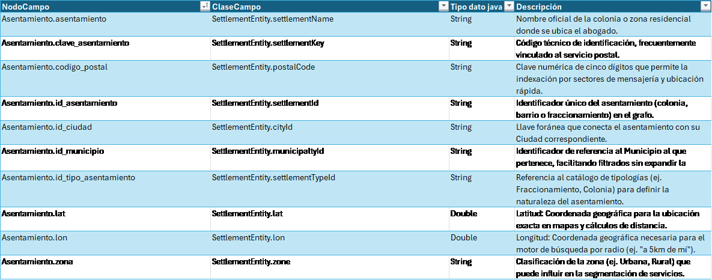
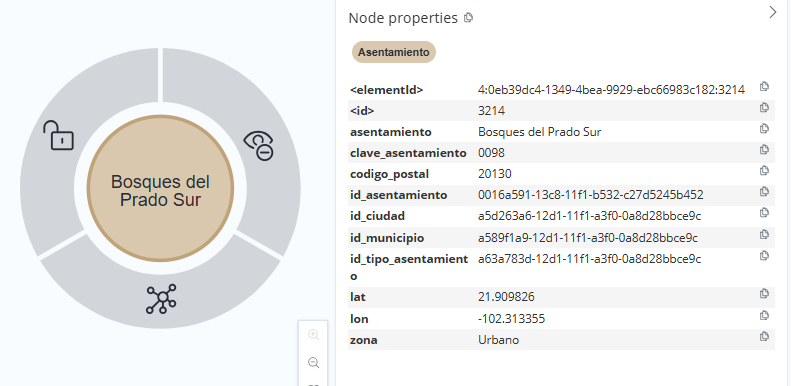
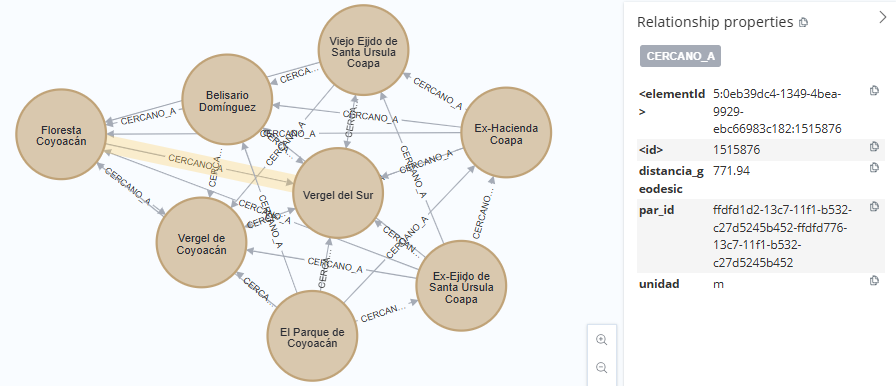

[← modelo de grafos](./modelo-de-grafos.md#nodos-de-catálogo)

# Asentamiento - SettlementEntity

El nodo **Asentamiento** representa una unidad territorial específica dentro del grafo geográfico. Constituye uno de los niveles más granulares de la estructura territorial y permite asociar una ubicación concreta con su contexto administrativo, urbano y de proximidad geográfica.

* **Referencia Geográfica y Ubicación:**
  El nodo contiene la referencia espacial del asentamiento mediante sus coordenadas geográficas (`lat`, `lon`), permitiendo representar su posición y calcular distancias entre ubicaciones a partir de sus coordenadas. Esta información proporciona la referencia geográfica necesaria para determinar relaciones de proximidad.

* **Identificación y Clasificación Territorial:**
  El asentamiento incorpora información que permite identificar y caracterizar la ubicación, incluyendo su código postal y su tipología territorial, como `Colonia`, `Fraccionamiento` u otros tipos de asentamiento. Esta clasificación permite mantener una representación normalizada de las distintas formas de ocupación territorial.

* **Unidad de Proximidad Geográfica:**
  El nodo participa en la representación de proximidad entre ubicaciones mediante relaciones `CERCANO_A`. Estas relaciones permiten establecer conexiones horizontales entre asentamientos y pueden contener la distancia existente entre ellos, facilitando la consulta de ubicaciones próximas dentro del grafo.

## Lógica de Conectividad

En la arquitectura de catálogos, el nodo **Asentamiento** se vincula con la estructura administrativa mediante la relación `ASENTAMIENTO_PERTENECE_A_MUNICIPIO`. Asimismo, puede relacionarse con un nodo `Ciudad` cuando forma parte de su estructura urbana.

La relación `CERCANO_A` permite conectar un asentamiento con otros asentamientos geográficamente próximos, formando una red horizontal independiente de la jerarquía administrativa. Esta estructura permite recorrer el territorio a partir de relaciones de proximidad y utilizar las distancias asociadas a dichas relaciones para determinar el alcance geográfico entre ubicaciones.

