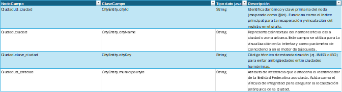
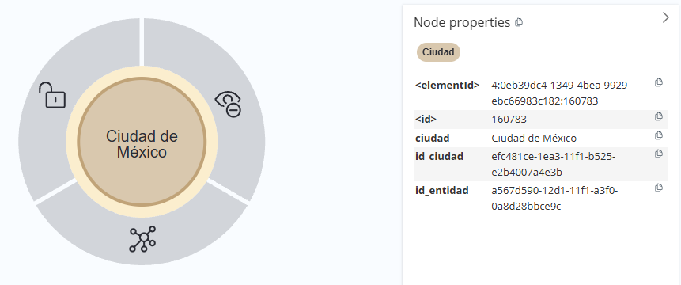
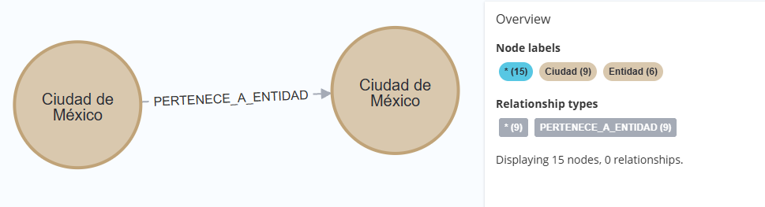

[← modelo de grafos](./modelo-de-grafos.md#nodos-de-catálogo)

# Ciudad - CityEntity
El nodo Ciudad representa una unidad de agregación urbana o metropolitana dentro del grafo. Su función es agrupar diversos sectores geográficos bajo una identidad de mancha urbana común.
* **Agrupación por Contexto Urbano:**
A diferencia del nodo `Municipio`, que es una división política, el nodo `Ciudad` permite agrupar demarcaciones que forman parte de una misma zona conurbada. Su función técnica es permitir que el sistema identifique centros poblacionales densos donde la continuidad urbana es más relevante que la división administrativa.

* **Estructura de Referencia Transversal:**
Actúa como un nodo de clasificación que facilita la organización de los datos en áreas de alta demanda. Su propósito es servir de punto de anclaje para perfiles que operan en zonas metropolitanas, garantizando que la información se segmente por núcleos urbanos reconocibles.

* **Normalización de Zonas Metropolitanas:**
Proporciona un catálogo estandarizado de nombres de ciudades, asegurando la integridad de los datos al evitar la fragmentación de registros en grandes urbes que abarcan múltiples jurisdicciones locales.

## Lógica de Conectividad
En la arquitectura de catálogos, el nodo Ciudad se vincula ascendentemente al nodo Entidad mediante la relación `CIUDAD_PERTENECE_A_ENTIDAD`. Asimismo, puede actuar como un nodo de agrupación para múltiples `Municipio` o `Asentamiento`, estableciendo una red de pertenencia que permite al grafo identificar la cohesión urbana de los datos geográficos independientemente de las fronteras municipales.

