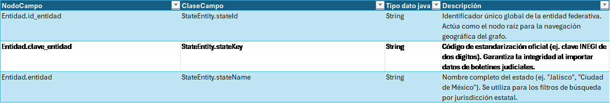
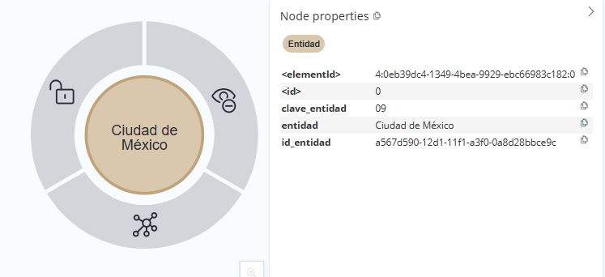
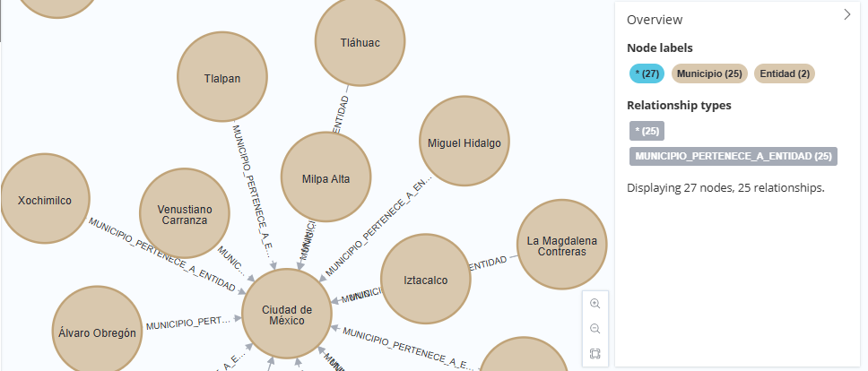

[← modelo de grafos](./modelo-de-grafos.md#nodos-de-catálogo)

# Entidad - StateEntity
El nodo Entidad constituye el ancla regional y el nivel superior de la jerarquía geográfica en el grafo. Es el contenedor principal que organiza la distribución territorial de los datos.
* **Nodo de Agregación Superior:**
Funciona como el vértice raíz de la estructura geoespacial. Su función técnica es agrupar niveles geográficos inferiores mediante relaciones de pertenencia, permitiendo una navegación descendente y estructurada en el grafo.

* **Segmentación de Consultas:**
Este nodo permite al motor de base de datos realizar particionamiento lógico de las búsquedas. Facilita la ejecución de filtros de alto nivel, permitiendo que el sistema delimite el universo de datos a una demarcación estatal antes de procesar nodos de menor jerarquía.

* **Identificación Administrativa Oficial:**
Al integrar claves normativas, el nodo actúa como el catálogo inmutable de referencia para las entidades federativas, garantizando la integridad referencial y la compatibilidad con estándares oficiales de datos territoriales.

## Lógica de Conectividad
En la arquitectura de catálogos, el nodo Entidad se sitúa en la cúspide de la pirámide geográfica. Recibe vínculos ascendentes desde el nodo Ciudad (CIUDAD_PERTENECE_A_ENTIDAD) y desde el nodo Municipio mediante la relación MUNICIPIO_PERTENECE_A_ENTIDAD. Esta estructura permite que el grafo realice una propagación de datos eficiente, donde cualquier perfil o registro vinculado a niveles inferiores quede automáticamente indexado bajo el contexto de su entidad federativa correspondiente.

  [1]: modelo-de-grafos.md
