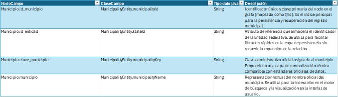
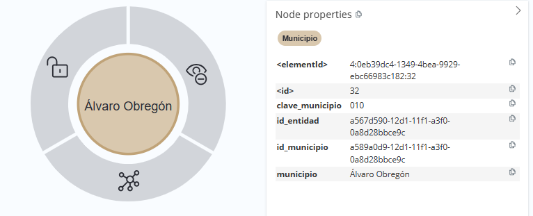
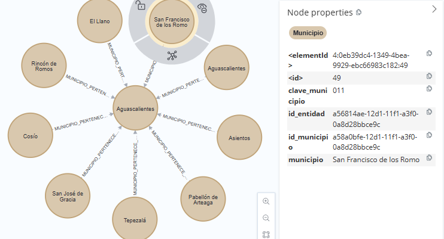

[← modelo de grafos](./modelo-de-grafos.md#nodos-de-catálogo)

# Municipio - MunicipalityEntity
El nodo Municipio representa la división política y administrativa intermedia dentro del grafo de AliadoLegal. Su función es servir de puente organizativo entre la Entidad Federativa y las unidades territoriales específicas.
* **Agrupación Administrativa y Legal:**
A diferencia del nodo Ciudad, que se enfoca en la mancha urbana, el nodo Municipio delimita las fronteras legales y de gobierno. Su función técnica es permitir que el sistema asocie perfiles y servicios a una demarcación con autoridad jurídica propia, facilitando la identificación de competencias territoriales.

* **Segmentación por Jurisdicción:**
Actúa como un filtro de segundo nivel que organiza los datos geográficos de manera estructurada. Su propósito es garantizar que la búsqueda de representación legal pueda acotarse a demarcaciones específicas, especialmente en contextos donde la competencia judicial se determina por cabeceras municipales.

* **Normalización Normativa:**
Proporciona un catálogo estandarizado que integra claves administrativas oficiales. Esto asegura la integridad de los datos al evitar la fragmentación de registros y permite la interoperabilidad con otras bases de datos gubernamentales o judiciales.

## Lógica de Conectividad
En la arquitectura de catálogos, el nodo `Municipio` se vincula ascendentemente al nodo Entidad mediante la relación `MUNICIPIO_PERTENECE_A_ENTIDAD`. Asimismo, actúa como el nodo de referencia para registros de asentamientos a través de la relación `ASENTAMIENTO_PERTENECE_A_MUNICIPIO`.

