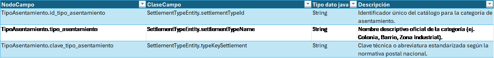
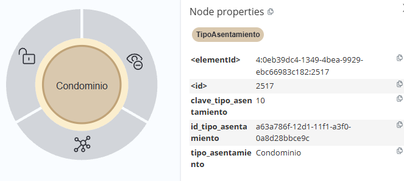
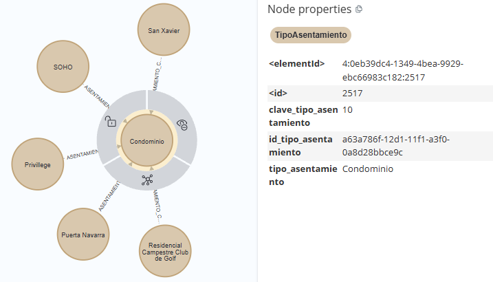

[← modelo de grafos](./modelo-de-grafos.md#nodos-de-catálogo)

# TipoAsentamiento - SettlementTypeEntity

### TipoAsentamiento - SettlementTypeEntity

El nodo **`TipoAsentamiento`** representa la clasificación territorial asociada a un asentamiento. Mientras que el nodo **`Asentamiento`** identifica una ubicación territorial específica, `TipoAsentamiento` proporciona la categoría que permite distinguir la naturaleza del asentamiento, como `Colonia`, `Fraccionamiento`, `Barrio` u otras clasificaciones contempladas por el catálogo.

* **Estandarización de la Clasificación Territorial:**
  Su función es proporcionar un catálogo normalizado de tipos de asentamiento mediante identificadores y descripciones consistentes. Esto permite que los asentamientos del grafo utilicen una clasificación común, evitando diferencias en la representación de un mismo tipo territorial.

* **Caracterización del Asentamiento:**
  Permite complementar la información del nodo `Asentamiento` mediante la identificación de su tipología territorial. De esta forma, la ubicación geográfica puede ser consultada no solamente por su identificación o posición, sino también por las características de clasificación establecidas en el catálogo.

* **Integridad Referencial del Catálogo:**
  Centraliza las definiciones de los tipos de asentamiento para que los nodos `Asentamiento` hagan referencia a valores válidos y consistentes. Esta relación evita mantener la descripción de la tipología directamente en cada asentamiento y permite mantener la clasificación como un catálogo reutilizable.

## Lógica de Conectividad

En la arquitectura de catálogos, el nodo **`TipoAsentamiento`** se relaciona con los nodos **`Asentamiento`** mediante una relación de clasificación. Esta conexión permite determinar el tipo territorial correspondiente a cada asentamiento y realizar consultas sobre el grafo utilizando dicha clasificación.

