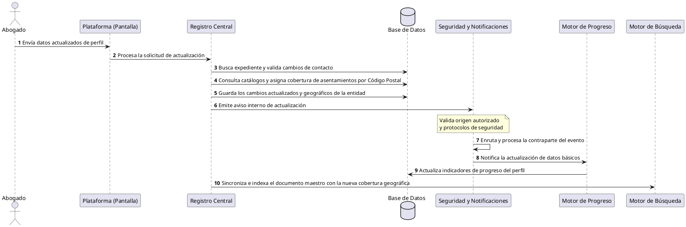

[← Volver a página principal](./../../README.md#estructura-de-la-documentación-técnica)

# Proceso de Actualización de Datos Básicos de un Abogado en la Plataforma

Este documento describe el proceso comercial y operativo que ocurre cuando un abogado registrado en **AliadoLegal** modifica su información personal, de contacto o su ubicación geográfica, asegurando la integridad de sus datos, la validación de cobertura por código postal y la sincronización de su perfil en la red. [Ver información técnica](../../microservicios/flujos/flujo-actualizacion-datos_basicos.md)

## 1. Visión General del Proceso

El proceso de actualización busca garantizar que la información de contacto y ubicación de los profesionales sea veraz, esté geográficamente validada y se encuentre perfectamente sincronizada. El sistema automatiza este flujo para que, ante cualquier cambio relevante (como un nuevo número telefónico, correo electrónico o código postal), se reevalúen automáticamente los estatus de validación del perfil, se consulten los catálogos territoriales oficiales para determinar los asentamientos donde el profesional puede ofrecer servicio, se actualicen los registros centrales, se notifique de forma segura a los módulos de control y se refresque el índice de búsqueda de la plataforma.

## 2. Flujo de Operación (Paso a Paso)

1. **Solicitud de Modificación:** El abogado envía sus datos actualizados de perfil (personales, contacto o ubicación) a través de la plataforma.
2. **Búsqueda y Verificación de Existencia:** El sistema localiza el expediente principal del profesional en la base de datos central; si el registro no existe, la operación se interrumpe de inmediato.
3. **Evaluación de Cambios en Contacto:** Se comparan los datos entrantes contra los históricos. Si el teléfono o el correo electrónico cambiaron, el sistema invalida sus estatus de validación previa por seguridad.
4. **Validación Territorial y de Asentamientos por Código Postal:** El sistema limpia los asentamientos previos y consulta los catálogos oficiales para ubicar el estado, municipio, ciudad y el listado completo de asentamientos vinculados al nuevo código postal. Si la información es válida, se asocian las zonas de cobertura geográfica y se marca el código postal como verificado; de lo contrario, se purgan los datos de ubicación.
5. **Resguardo Seguro de la Información:** Todos los cambios validados y la nueva cobertura territorial se guardan de forma atómica y segura en la base de datos de la plataforma.
6. **Emisión de Aviso de Actualización:** El sistema genera un aviso interno indicando que se han modificado los datos básicos del profesional.
7. **Validación de Canal Seguro:** La plataforma verifica mediante estrictos protocolos de seguridad que el aviso provenga de una ruta autorizada de actualización y no de accesos externos o no permitidos.
8. **Procesamiento de Seguimiento:** Se activa un flujo secundario de control para preparar la actualización de los indicadores de progreso del perfil.
9. **Recepción y Enrutamiento del Evento:** El sistema de respuesta recibe la confirmación del evento procesado y lo canaliza hacia el módulo de validación de avance.
10. **Actualización de Progreso y Sincronización de Búsqueda:** El sistema actualiza los indicadores de cumplimiento del perfil y ejecuta de manera asíncrona la sincronización e indexación del documento maestro en el motor de búsqueda —incorporando las nuevas zonas de asentamiento para el matching de casos—, dejando el perfil listo y actualizado para los usuarios de la red.

## 3. Resumen Operativo

| Fase | Área Encargada | Lo que ocurre en el negocio |
| --- | --- | --- |
| **1. Solicitud** | Interfaz de Usuario | El abogado envía sus datos de perfil modificados a la plataforma. |
| **2 y 3. Verificación** | Registro Central | Se localiza al profesional y se evalúa si hubo cambios en los canales de contacto. |
| **4. Validación Territorial** | Catálogos Geográficos | Se consulta el código postal para asociar el estado, municipio y los asentamientos donde el abogado podrá prestar sus servicios. |
| **5. Resguardo** | Base de Datos | Se guardan de manera segura los datos personales y la nueva cobertura geográfica. |
| **6. Aviso de Modificación** | Notificación Interna | El sistema emite un aviso sobre la actualización de datos básicos. |
| **7 y 8. Verificación** | Protocolos de Seguridad | Se comprueba que la instrucción cumpla con las reglas de origen autorizado y se enruta. |
| **9. Enrutamiento** | Control de Flujo | Se transfiere la información hacia los módulos de validación de progreso. |
| **10. Sincronización Final** | Motor de Búsqueda y Progreso | Se actualiza el avance del perfil y se indexa el documento con su nueva cobertura en el motor de búsqueda. |

---

## 4. Diagrama de Secuencia

---