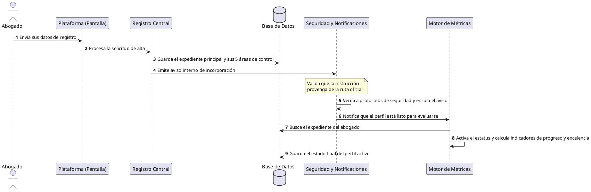

[← Volver a página principal](./../../README.md#estructura-de-la-documentación-técnica)

# Proceso de Alta y Activación de un Abogado en la Plataforma

Este documento describe el proceso comercial y operativo que ocurre desde que un profesional del derecho decide unirse a **AliadoLegal** hasta que su perfil queda completamente activo y evaluado dentro de la red. [Ver información técnica](../../microservicios/flujos/flujo-creacion-abogado.md)

## 1. Visión General del Proceso

El proceso de incorporación busca garantizar que cada abogado que ingresa a la plataforma cuente con un perfil completo, verificado y listo para operar. El sistema automatiza este registro para que, en un solo momento, se active su identidad central, sus credenciales profesionales, sus métricas de reputación y sus indicadores de calidad, asegurando que el sistema comience a medir su desempeño de inmediato.

## 2. Flujo de Operación (Paso a Paso)

1. **Solicitud de Registro:** El abogado ingresa sus datos generales a través de la plataforma para solicitar su alta oficial.
2. **Creación del Perfil Base y Módulos de Apoyo:** El sistema registra la información principal del profesional y genera automáticamente sus cinco expedientes complementarios de control (perfil profesional, historial de validaciones, métricas de reputación, puntaje de excelencia y nivel de avance).
3. **Resguardo Seguro de la Información:** Toda la estructura del perfil y sus submódulos se guardan de forma simultánea y segura en la base de datos central de la plataforma.
4. **Emisión de Aviso de Incorporación:** El sistema genera un aviso interno indicando que un nuevo profesional se ha incorporado con éxito a la red.
5. **Validación de Canal Seguro:** La plataforma verifica de manera automática que el aviso provenga de un proceso autorizado de registro y no de una ruta ajena o no permitida.
6. **Procesamiento de Seguimiento:** Se activa un flujo secundario de control para preparar la actualización de los indicadores operativos del nuevo miembro.
7. **Verificación de Origen del Mensaje:** El sistema valida nuevamente que la orden de actualización cumpla con los protocolos de seguridad establecidos.
8. **Recepción de la Notificación:** El sistema de respuesta recibe la confirmación de que el perfil ha sido procesado correctamente y lo canaliza hacia el módulo de evaluación de desempeño.
9. **Activación y Cálculo de Excelencia:** El sistema localiza al abogado recién registrado, cambia su estado a "perfil activo/completado", calcula sus indicadores iniciales de progreso y excelencia, y guarda el estado final listo para que el profesional comience a recibir casos.

## 3. Resumen operativo

| Fase | Área Encargada | Lo que ocurre en el negocio |
| --- | --- | --- |
| **1. Solicitud** | Interfaz de Usuario | El abogado envía sus datos de registro a la plataforma. |
| **2. Creación Base** | Registro Central | Se crea el expediente principal junto con sus cinco áreas de control y seguimiento. |
| **3. Resguardo** | Base de Datos | Se guardan los datos de manera segura y unificada. |
| **4. Aviso de Alta** | Notificación Interna | El sistema emite un aviso de que el registro inicial ha concluido. |
| **5 y 6. Verificación** | Protocolos de Seguridad | Se comprueba que la instrucción sea legítima y provenga de la ruta de registro oficial. |
| **7 y 8. Enrutamiento** | Control de Flujo | Se transfiere la información hacia los módulos encargados de medir el desempeño. |
| **9. Activación Final** | Motor de Métricas y Progreso | Se activa oficialmente el perfil del abogado, se calculan sus puntajes iniciales y queda disponible en la red. |

---

## 4. Diagrama de secuencia

---