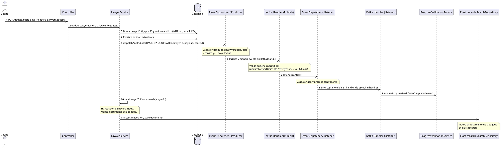

[← Volver a la Documentación Principal](../../README.md)

# Flujo técnico de Negocio: Actualización de Datos Básicos del Abogado (`/api/lawyer/update/basic_data`)

Este documento detalla el proceso técnico y de negocio para la modificación y validación de datos personales, geográficos y de contacto de un abogado registrado, incluyendo su sincronización en el motor de búsqueda. [Ver información ejecutiva](../../ejecutivo/flujos/flujo-actualizacion-datos_basicos.md)

**AliadoLegal**.

## 1. Visión General

El flujo de actualización de datos básicos permite modificar la información personal, de contacto y ubicación de un abogado existente. Utiliza un enfoque atómico y orientado a eventos (Event-Driven Architecture) mediante Spring Boot y Apache Kafka. Su propósito es verificar si hubo cambios en el teléfono, correo electrónico o código postal para reevaluar sus estatus de validación, persistir los cambios transaccionalmente en la base de datos de grafos (Neo4j), despachar el evento de dominio hacia el broker de Kafka a través de la cadena completa de producción, consumo y escucha para actualizar el progreso del perfil, y ejecutar de manera asíncrona la sincronización e indexación del documento del abogado en Elasticsearch fuera de la transacción de base de datos.

## 2. Flujo de Operación

1. **Recepción de la Solicitud:** El cliente invoca el endpoint `PUT /api/lawyer/update/basic_data` enviando un objeto `LawyerRequest`. La petición valida las cabeceras mediante `@HeaderConstraint` y la estructura del cuerpo antes de continuar.
2. **Búsqueda y Verificación de Existencia:** En la capa de servicio (`updateLawyerBasicData`), se busca la entidad del abogado en la base de datos por su `lawyerId` utilizando el repositorio. Si no existe, se interrumpe la ejecución lanzando una excepción de dominio (`LawyerNotFoundException`).
3. **Evaluación de Cambios en Contacto:** Se compara el teléfono móvil y el correo electrónico recibidos contra los valores almacenados actualmente en la entidad (`phoneChanged`, `emailChanged`), reevaluando sus respectivos indicadores de validación (`isPhoneValidated`, `isMailValidated`).
4. **Actualización de Datos Personales y Geográficos:** Se actualizan los campos básicos de la entidad del abogado, se limpian los asentamientos previos y se consulta la información geográfica (Estado, Municipio, Ciudad y Asentamientos) asociada al código postal provisto para marcar o desmarcar `isCPValidated`.
5. **Persistencia Transaccional:** Se guardan los cambios actualizados del abogado en la base de datos.
6. **Despacho y Producción del Evento (`publish`):** Se obtiene el contexto de llamada y se invoca el dispatcher productor para emitir el evento (`BASIC_DATA`, `UPDATED`). El componente productor valida estrictamente mediante `OriginValidator` que la llamada provenga de la ruta autorizada (`LawyerServiceImpl.updateLawyerBasicData`), construye el objeto `LawyerEvent` y lo publica en el broker de Kafka.
7. **Consumo y Validación en Kafka Handler (`handle`):** El componente manejador intercepta el mensaje desde Kafka, registra la traza de consumo y evalúa los orígenes permitidos (`updateLawyerBasicData`, `verifyPhone`, `verifyEmail`). Si la validación es exitosa, delega la ejecución al dispatcher de escucha.
8. **Despacho de Escucha (`listener`):** El dispatcher de escucha valida el contexto y procesa el flujo hacia la contraparte de escucha.
9. **Manejador de Escucha (`handle` / Listener Handler):** Intercepta la llamada de escucha y delega la ejecución al servicio de respuesta a eventos (`eventBasicDataUpdated`).
10. **Delegación y Actualización de Progreso:** El servicio de respuesta recibe el evento procesado y delega la actualización de la validación de datos básicos hacia el servicio especializado de progreso (`lawyerProgressValidationService.updateProgressBasicDataCompleted`).
11. **Sincronización e Indexación en Elasticsearch (`syncLawyerToElasticsearch`):** Fuera de la transacción de la base de datos, se recuperan los datos sincronizables, se mapean al documento correspondiente y se persiste directamente en el repositorio de Elasticsearch (`searchRepository.save`).

## 3. Diagrama de Secuencia Lógico

| Paso | Componente | Acción |
| --- | --- | --- |
| 1 | Controller | Recibe `PUT /update/basic_data` con cabeceras y `LawyerRequest`. |
| 2 | LawyerService (`updateLawyerBasicData`) | Busca al abogado por ID, evalúa cambios y procesa geolocalización por código postal. |
| 3 | Database | Persiste los cambios de la entidad actualizada. |
| 4 | EventDispatcher / Producer (`publish`) | Valida el origen, construye el `LawyerEvent` con el payload y publica en Kafka. |
| 5 | Kafka Handler (`handle`) | Intercepta el mensaje, valida los orígenes permitidos y delega. |
| 6 | EventDispatcher / Listener (`listener`) | Valida el origen y procesa la contraparte de escucha. |
| 7 | Kafka Handler Listener (`handle`) | Intercepta y valida en el handler de escucha, delegando al servicio de respuesta. |
| 8 | ProgressValidationService | Actualiza el estatus de validación del progreso en base al evento procesado. |
| 9 | LawyerService (`syncLawyerToElasticsearch`) | Sincroniza y guarda el documento del abogado en Elasticsearch fuera de la transacción. |

---

## Diagrama de Secuencia

[← Volver a la Documentación Principal](../../README.md)