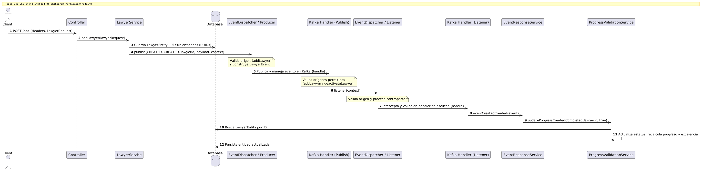

[← Volver a la Documentación Principal](../../README.md)
# Flujo técnico de Negocio: Creación de Abogado (Onboarding Inicial)
Este documento detalla el proceso técnico y de negocio para el registro inicial de un abogado en la plataforma **AliadoLegal**. [Ver información ejecutiva](../../ejecutivo/flujos/flujo-creacion-abogado.md)


## 1. Visión General
El flujo de creación constituye el primer paso del proceso de *onboarding*. Utiliza un enfoque atómico y orientado a eventos (Event-Driven Architecture) mediante Spring Boot y Apache Kafka. Su propósito es inicializar la identidad del abogado junto con sus sub-entidades operativas (progreso, reputación, excelencia, validación y perfil profesional) y despachar el evento correspondiente a través de un mecanismo de producción y consumo validado por contexto para actualizar asíncronamente las métricas de progreso y excelencia.

## 2. Flujo de Operación

1. **Recepción de la Solicitud:** El cliente invoca el endpoint `POST /api/lawyer/add` enviando un objeto `LawyerRequest`. La petición valida cabeceras (`@HeaderConstraint`) y la estructura del cuerpo antes de continuar.
2. **Inicialización de Entidades:** En la capa de servicio principal (`addLawyer`), se construye la entidad principal (`LawyerEntity`) y se instancian sus **cinco sub-entidades operativas** asociadas con identificadores únicos (UUID):
    - `LawyerExcellenceEntity`
    - `LawyerProgressEntity`
    - `LawyerValidationEntity`
    - `LawyerReputationEntity`
    - `LawyerProfessionalProfileEntity`
3. **Persistencia Transaccional:** La estructura completa del abogado y sus sub-entidades se persiste en la base de datos de manera transaccional.
4. **Despacho y Producción del Evento (`publish`):** Se invoca el dispatcher para emitir el evento (`CREATED`, `CREATED`). El componente productor intercepta la llamada, ejecuta el validador de origen mediante `OriginValidator` para asegurar que la llamada provenga estrictamente de la ruta autorizada (`LawyerServiceImpl.addLawyer`), construye el objeto `LawyerEvent` con el payload y metadatos del contexto, y finalmente lo envía al broker de Kafka.
5. **Consumo, Enrutamiento y Validación en Handler (`handle`):** El componente manejador intercepta el mensaje desde Kafka, registra la traza de consumo y evalúa los orígenes permitidos mediante una lista de orígenes esperados (`LawyerServiceImpl.deactivateLawyer` o `LawyerServiceImpl.addLawyer`). Si la validación es exitosa, delega la ejecución al servicio de respuesta a eventos.
6. **Delegación de Evento (`EventResponseService.eventCreatedCreated`):** El servicio de respuesta recibe el evento procesado y redirige la llamada hacia el servicio especializado de validación y control de avance.
7. **Actualización Final de Progreso y Excelencia (`updateProgressCreatedCompleted`):** El servicio de validación recupera al abogado por su identificador único, activa el indicador de creación (`isCompleted = true`), ejecuta los métodos de recálculo conjunto para el progreso total (`calcTotalProgress`) y la excelencia total (`calcTotalExcellence`), y persiste la entidad actualizada en la base de datos.

## 3. Diagrama de Secuencia Lógico

| Paso | Componente | Acción |
| :--- | :--- | :--- |
| 1 | Controller | Recibe `LawyerRequest` en `POST /add` con cabeceras. |
| 2 | LawyerService (`addLawyer`) | Crea la entidad principal, las 5 sub-entidades (UUIDs) y persiste en BD. |
| 3 | EventDispatcher / Producer (`publish`) | Valida el origen (`addLawyer`), construye el `LawyerEvent` y publica el mensaje en Kafka. |
| 4 | Kafka Handler Publish (`handle`) | Intercepta el mensaje, valida los orígenes permitidos (`addLawyer` o `deactivateLawyer`) y delega. |
| 5 | EventDispatcher / listener (`listener`) | Valida el origen (`addLawyer`), construye el `LawyerEvent` y publica el mensaje en Kafka. |
| 6 | Kafka Handler listener (`handle`) | Intercepta el mensaje, valida los orígenes permitidos (`addLawyer` o `deactivateLawyer`) y delega. |
| 7 | EventResponseService (`eventCreatedCreated`) | Recibe la notificación del handler y transfiere el flujo al servicio de validación de progreso. |
| 8 | ProgressValidationService (`updateProgressCreatedCompleted`) | Busca al abogado, actualiza el estatus de creación, recalcula progreso y excelencia, y guarda en BD. |

---
## Diagrama de Secuencia
```
@startuml
autonumber
skinparam BoxPadding 10
skinparam ParticipantPadding 10

actor Client
participant "Controller" as C
participant "LawyerService" as S
database "Database" as DB
participant "EventDispatcher / Producer" as ED
participant "Kafka Handler (Publish)" as KHP
participant "EventDispatcher / Listener" as EDL
participant "Kafka Handler (Listener)" as KHL
participant "EventResponseService" as ERS
participant "ProgressValidationService" as PVS

Client -> C: POST /add (Headers, LawyerRequest)
C -> S: addLawyer(lawyerRequest)
S -> DB: Guarda LawyerEntity + 5 Sub-entidades (UUIDs)
S -> ED: publish(CREATED, CREATED, lawyerId, payload, context)
note over ED: Valida origen (addLawyer)\ny construye LawyerEvent
ED -> KHP: Publica y maneja evento en Kafka (handle)
note over KHP: Valida orígenes permitidos\n(addLawyer / deactivateLawyer)
KHP -> EDL: listener(context)
note over EDL: Valida origen y procesa contraparte
EDL -> KHL: Intercepta y valida en handler de escucha (handle)
KHL -> ERS: eventCreatedCreated(event)
ERS -> PVS: updateProgressCreatedCompleted(lawyerId, true)
PVS -> DB: Busca LawyerEntity por ID
PVS -> PVS: Actualiza estatus, recalcula progreso y excelencia
PVS -> DB: Persiste entidad actualizada
@enduml
```


[← Volver a la Documentación Principal](../../README.md)