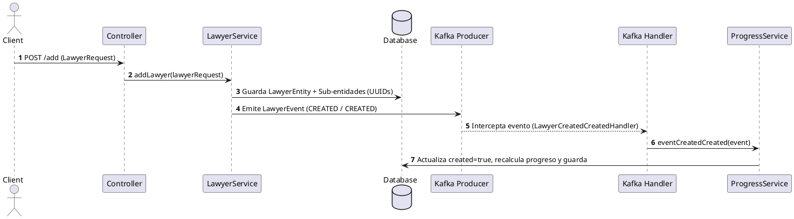

[← Volver](../README.md#catalogo-de-endpoints-rest)

# Flujo de Negocio: Creación de Abogado (Onboarding Inicial)
Este documento detalla el proceso técnico y de negocio para el registro inicial de un abogado en la plataforma **AliadoLegal**.

## 1. Visión General
El flujo de creación constituye el primer paso del proceso de *onboarding*. Utiliza un enfoque atómico y orientado a eventos (Event-Driven Architecture) mediante Spring Boot y Apache Kafka. Su propósito es inicializar la identidad del abogado junto con sus sub-entidades operativas (progreso, reputación, excelencia y validación).

## 2. Flujo de Operación

1. **Recepción de la Solicitud:** El cliente invoca el endpoint `POST /add` enviando un objeto `LawyerRequest`. La petición valida cabeceras (`@HeaderConstraint`) y la estructura del cuerpo antes de continuar.
2. **Inicialización de Entidades:** En la capa de servicio (`addLawyer`), se construye la entidad principal (`LawyerEntity`) y se instancian sus relaciones iniciales con identificadores únicos (UUID):
    - `LawyerExcellenceEntity`
    - `LawyerProgressEntity`
    - `LawyerValidationEntity`
    - `LawyerReputationEntity`
3. **Persistencia y Emisión de Evento:** La entidad completa se guarda en la base de datos. Inmediatamente después, se emite un evento de dominio `LawyerEvent` (etapa `CREATED`, tipo `CREATED`) a través de Kafka mediante `lawyerEventProducer`.
4. **Procesamiento de Evento y Actualización de Progreso:** El componente `LawyerCreatedCreatedHandler` captura el evento emitido y delega la ejecución al servicio de respuesta. Se invoca `updateCreatedCompleted`, el cual establece el flag `created = true` en el progreso del abogado, recalcula el avance total (`calcTotalProgress`) y persiste la actualización.

## 3. Diagrama de Secuencia Lógico

| Paso | Componente | Acción |
| :--- | :--- | :--- |
| 1 | Controller | Recibe `LawyerRequest` en `POST /add`. |
| 2 | LawyerService | Crea la entidad, sub-entidades (UUIDs) y persiste. |
| 3 | Producer | Emite evento Kafka (`CREATED` / `CREATED`). |
| 4 | Handler | `LawyerCreatedCreatedHandler` intercepta el evento. |
| 5 | ProgressService | Invoca `updateCreatedCompleted`, activa `created=true`, recalcula progreso y guarda. |

## Diagrama de Secuencia

[← Volver](../README.md)